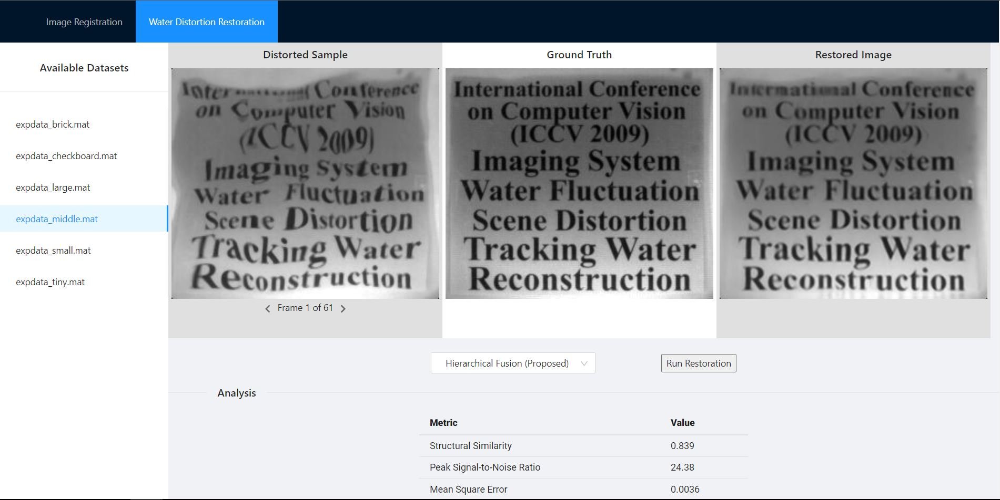

# Web Server for Project 'Imaging through Water' #
This project showcases a novel image stablization algorithm, which aims to remove distortion caused by water refraction.



## System Requirements
Linux system with npm 6+ and Python 3.8+

## Build
To generate a build for UI and configure backend dependencies, execute the `build.sh` script
```
./build.sh
```

## Server Start and Shutdown
To start the server, execute the server startup script
```
cd server
./startup.sh
```

To stop the server, execute the server shutdown script
```
cd server
./shutdown.sh
```

## Access the Web Application
Use the link `localhost:8888` to access the web application.
